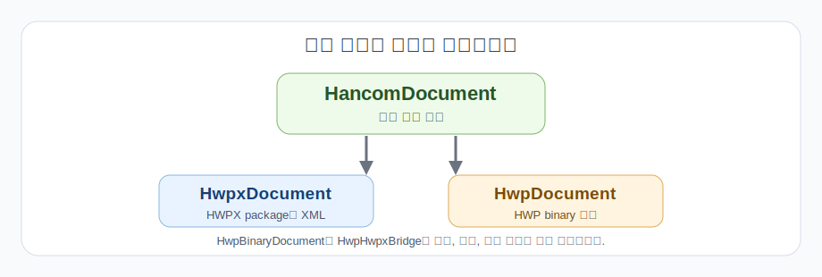

# `jakal_hwpx` 모듈 가이드

이 문서는 README에 넣기에는 긴 모듈별 사용 설명을 따로 정리한 문서입니다. 일반적인 앱 코드는 `HancomDocument`부터 시작하고, 포맷 내부를 직접 만져야 할 때만 `HwpxDocument`나 `HwpDocument`로 내려가면 됩니다.



## 전체 그림

`jakal_hwpx`의 공개 클래스는 많지만, 사용 흐름은 단순하게 잡는 편이 좋습니다.

| 레이어 | 클래스 | 쓰는 순간 |
|---|---|---|
| 기본 편집 모델 | `HancomDocument` | HWP/HWPX를 같은 코드로 읽고 만들고 저장할 때 |
| HWPX 포맷 레이어 | `HwpxDocument` | HWPX package, XML part, strict lint를 직접 다룰 때 |
| HWP 포맷 레이어 | `HwpDocument` | HWP binary 문서를 직접 열고 저장하거나 HWP 전용 wrapper가 필요할 때 |
| 저수준 조사 레이어 | `HwpBinaryDocument` | record tree, stream, DocInfo, reencode 문제를 조사할 때 |
| 전환 도우미 | `HwpHwpxBridge` | 변환 경로를 명시적으로 잡아 실험하거나 회귀를 만들 때 |

처음 코드를 작성한다면 이 문서의 `HancomDocument` 부분만 봐도 충분합니다.

## `HancomDocument`

`HancomDocument`는 이 패키지의 기본 진입점입니다. 입력이 `.hwp`이든 `.hwpx`이든 같은 편집 모델로 올린 뒤, 필요한 포맷으로 다시 저장합니다.

대표 진입점은 아래 네 가지입니다.

| API | 용도 |
|---|---|
| `HancomDocument.blank()` | 새 문서 만들기 |
| `HancomDocument.read_hwpx(path)` | HWPX 읽기 |
| `HancomDocument.read_hwp(path)` | HWP 읽기 |
| `write_to_hwpx(path)`, `write_to_hwp(path)` | 원하는 포맷으로 저장 |

새 문서를 만드는 예입니다.

```python
from jakal_hwpx import HancomDocument

doc = HancomDocument.blank()
doc.metadata.title = "보고서"

doc.append_paragraph("첫 문단")
doc.append_table(
    rows=2,
    cols=2,
    cell_texts=[["A", "B"], ["1", "2"]],
)

doc.write_to_hwpx("build/report.hwpx")
doc.write_to_hwp("build/report.hwp")
```

기존 HWP를 읽어서 HWPX도 같이 내보내는 예입니다.

```python
from jakal_hwpx import HancomDocument

doc = HancomDocument.read_hwp("input.hwp")
doc.append_paragraph("추가 문단")

doc.write_to_hwp("build/output.hwp")
doc.write_to_hwpx("build/output.hwpx")
```

`HancomDocument`에서 자주 쓰는 append API는 다음 정도입니다.

| API | 용도 |
|---|---|
| `append_paragraph()` | 문단 추가 |
| `append_table()` | 표 추가 |
| `append_picture()` | 그림 추가 |
| `append_hyperlink()` | 하이퍼링크 추가 |
| `append_bookmark()` | 북마크 추가 |
| `append_field()` | 필드 추가 |
| `append_note()` | 각주나 미주 추가 |
| `append_header()`, `append_footer()` | 머리말과 꼬리말 추가 |
| `append_equation()`, `append_shape()`, `append_ole()` | 수식, 도형, OLE 추가 |

## `HwpxDocument`

`HwpxDocument`는 HWPX를 직접 다루는 하위 레이어입니다. HWPX가 zip 안에 XML part를 담는 구조이므로, XML wrapper나 package part를 직접 보고 싶을 때 사용합니다.

```python
from jakal_hwpx import HwpxDocument

doc = HwpxDocument.open("input.hwpx")
doc.replace_text("초안", "최종")
doc.append_paragraph("승인 완료")

doc.strict_validate()
doc.save("build/output.hwpx")
```

이 레이어가 필요한 경우는 보통 아래와 같습니다.

- 입력과 출력이 모두 HWPX이고 HWP 변환이 필요 없을 때
- HWPX part, manifest, preview text 같은 package 구조를 직접 확인할 때
- `strict_lint_errors()`, `strict_lint_report()`, `strict_validate()`를 HWPX 기준으로 바로 돌릴 때

## `HwpDocument`

`HwpDocument`는 HWP binary 문서를 직접 다루는 하위 레이어입니다. HWP를 읽고 다시 HWP로 저장해야 하거나, HWP 전용 control wrapper를 써야 할 때 사용합니다.

```python
from jakal_hwpx import HwpDocument

doc = HwpDocument.open("input.hwp")
doc.append_paragraph("추가 문단")

doc.strict_validate()
doc.save("build/output.hwp")
```

이 레이어가 필요한 경우는 보통 아래와 같습니다.

- 기존 `.hwp` 파일을 직접 수정해서 다시 `.hwp`로 저장할 때
- HWP 기준의 `tables()`, `fields()`, `notes()`, `section()` wrapper가 필요할 때
- HWP의 native record 구조와 연결된 동작을 확인할 때

## `HwpBinaryDocument`

`HwpBinaryDocument`는 일반 앱 코드의 기본 편집 객체가 아닙니다. HWP reverse engineering, record 단위 디버깅, reencode 안정성 확인에 쓰는 저수준 API입니다.

```python
from jakal_hwpx import HwpBinaryDocument

doc = HwpBinaryDocument.open("input.hwp")
print(doc.file_header().version)
print(doc.docinfo_model().id_mappings_record().named_counts())
print(doc.section_model(0).controls())
```

문서가 깨지는 원인을 찾거나, 아직 매핑되지 않은 control payload를 조사할 때 이 레이어로 내려갑니다.

## `HwpHwpxBridge`

`HwpHwpxBridge`는 변환 경로를 명시적으로 붙잡아야 할 때 쓰는 도우미입니다. 일반 작성 코드는 `HancomDocument.read_hwp()`와 `HancomDocument.read_hwpx()`로 충분한 경우가 많습니다.

```python
from jakal_hwpx import HwpHwpxBridge

bridge = HwpHwpxBridge.open("input.hwp")
bridge.save_hwpx("build/output.hwpx")
bridge.save_hwp("build/output-copy.hwp")
```

bridge는 회귀 테스트나 변환 실험에서 "어떤 포맷을 기준으로 materialize했는가"를 분명히 남기고 싶을 때 유용합니다.

## 검증 기준

지원 범위는 느낌으로 적지 않고 회귀 테스트와 lint 경로를 기준으로 봅니다.

| 흐름 | 기준 |
|---|---|
| `HWPX -> HWPX` | HWPX 직접 수정, 저장, 재오픈, strict lint |
| `HWP -> HWP` | HWP 직접 수정, 저장, 재오픈, binary/reencode 회귀 |
| `HWP -> HWPX` | HWP를 공통 모델로 읽은 뒤 HWPX로 다시 쓰는 roundtrip |
| `HWPX -> HWP` | HWPX를 공통 모델로 읽은 뒤 HWP로 다시 쓰는 roundtrip |

주요 회귀 명령은 아래와 같습니다.

```bash
python -m pytest tests/test_hancom_document.py tests/test_bridge.py -q
```

릴리스 기준은 [STABILITY_CONTRACT.md](./STABILITY_CONTRACT.md)와 `scripts/check_release.py`를 따릅니다.

## 정리

- 앱 코드의 기본값은 `HancomDocument`입니다.
- `HwpxDocument`와 `HwpDocument`는 포맷별 하위 레이어입니다.
- `HwpBinaryDocument`는 조사와 디버깅용입니다.
- `HwpHwpxBridge`는 변환 경로를 명시해야 할 때만 씁니다.
