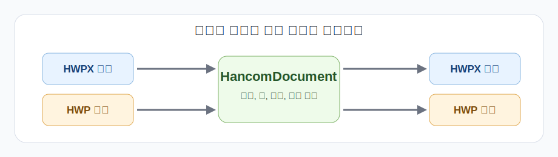

# jakal-hwpx

Python에서 HWP/HWPX 문서를 코드로 만들고 고치는 패키지입니다.

일반적인 문서 자동화 코드는 `HancomDocument` 하나로 시작하면 됩니다. `.hwp`와 `.hwpx`의 차이는 읽고 저장하는 순간에만 다루고, 본문 편집은 같은 객체 모델로 처리하는 쪽을 기본 사용법으로 둡니다.



## 설치

요구 사항은 Python 3.11 이상입니다.

```bash
python -m pip install --upgrade pip
python -m pip install jakal-hwpx
```

로컬 체크아웃에서 개발 의존성까지 설치하려면 다음처럼 실행합니다.

```bash
python -m pip install -e .[dev]
```

패키지 이름은 `jakal-hwpx`, import 경로는 `jakal_hwpx`입니다.

## 기본 개념

HWPX는 zip 기반 XML 패키지이고, HWP는 OLE 기반 binary 문서입니다. 두 포맷은 내부 구조가 다르지만, 앱 코드가 매번 그 차이를 떠안으면 쉽게 복잡해집니다.

그래서 이 패키지는 기본 편집 모델을 `HancomDocument`로 둡니다.

```text
read_hwp/read_hwpx -> HancomDocument에서 편집 -> write_to_hwp/write_to_hwpx
```

처음에는 이 흐름만 기억하면 충분합니다. `HwpxDocument`와 `HwpDocument`는 포맷별 세부 구조를 직접 만져야 할 때 내려가는 하위 레이어입니다.


## 가장 작은 예제

새 문서를 만들고 HWPX와 HWP를 둘 다 저장하는 예입니다.

```python
from jakal_hwpx import HancomDocument

doc = HancomDocument.blank()
doc.metadata.title = "분기 보고서"

doc.append_paragraph("매출 요약")
doc.append_table(
    rows=2,
    cols=2,
    cell_texts=[["구분", "금액"], ["1분기", "120"]],
)

doc.write_to_hwpx("build/report.hwpx")
doc.write_to_hwp("build/report.hwp")
```

기존 문서를 읽을 때도 편집 코드는 거의 같습니다.

```python
from jakal_hwpx import HancomDocument

doc = HancomDocument.read_hwp("input.hwp")
doc.append_paragraph("검토 완료")

doc.write_to_hwp("build/output.hwp")
doc.write_to_hwpx("build/output.hwpx")
```

## 언제 하위 클래스를 쓰나

대부분의 사용자는 `HancomDocument`를 쓰면 됩니다. 아래 클래스는 README에서 길게 설명하지 않고, 필요한 상황만 짧게 정리합니다.

| 클래스 | 역할 |
|---|---|
| `HancomDocument` | 앱 코드에서 먼저 잡을 기본 문서 모델 |
| `HwpxDocument` | HWPX 패키지, XML part, HWPX 검증을 직접 다룰 때 |
| `HwpDocument` | HWP binary 문서를 포맷 레이어에서 직접 다룰 때 |
| `HwpBinaryDocument` | record tree, stream, DocInfo를 조사할 때 쓰는 저수준 API |
| `HwpHwpxBridge` | 포맷 전환 경로를 직접 고정해서 실험하거나 디버깅할 때 쓰는 도우미 |

공개 모듈과 세부 API 문서는 [HWPX_MODULE.md](./HWPX_MODULE.md)에 모아 둡니다.

## 검증

문서를 저장한 뒤에는 테스트와 lint 경로로 다시 열 수 있는지 확인하는 편이 안전합니다.

```bash
python -m pytest tests/test_hancom_document.py tests/test_bridge.py -q
```

릴리스 전에 전체 회귀를 확인하려면 다음 명령을 사용합니다.

```bash
python scripts/check_release.py
```

Windows에서 실제 한컴 프로그램으로 열림 여부까지 확인하려면 smoke validation 스크립트를 추가로 실행합니다.

```powershell
powershell -ExecutionPolicy Bypass -File scripts/run_hancom_smoke_validation.ps1 -InputPath input.hwpx -OutputPath build\roundtrip.hwpx
```

## 추가 문서

- [HWPX_MODULE.md](./HWPX_MODULE.md): 공개 모듈/API 문서 인덱스
- [STABILITY_CONTRACT.md](./STABILITY_CONTRACT.md): 지원 범위와 release gate 기준
- [examples/SHOWCASE.md](./examples/SHOWCASE.md): 생성 예시 모음
- [THIRD_PARTY_NOTICES.md](./THIRD_PARTY_NOTICES.md): 샘플 문서와 재배포 고지

## 라이선스

프로젝트 소스 코드는 [MIT](./LICENSE) 라이선스를 따릅니다.
